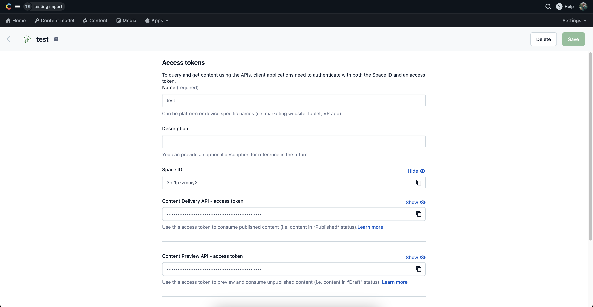
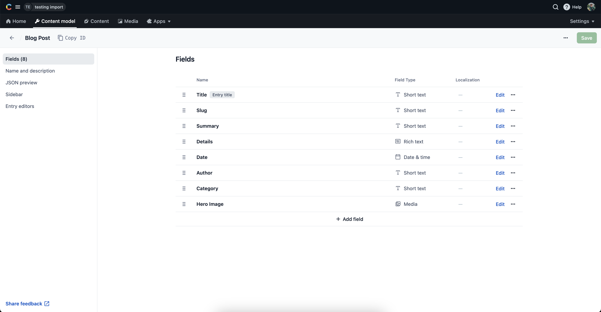
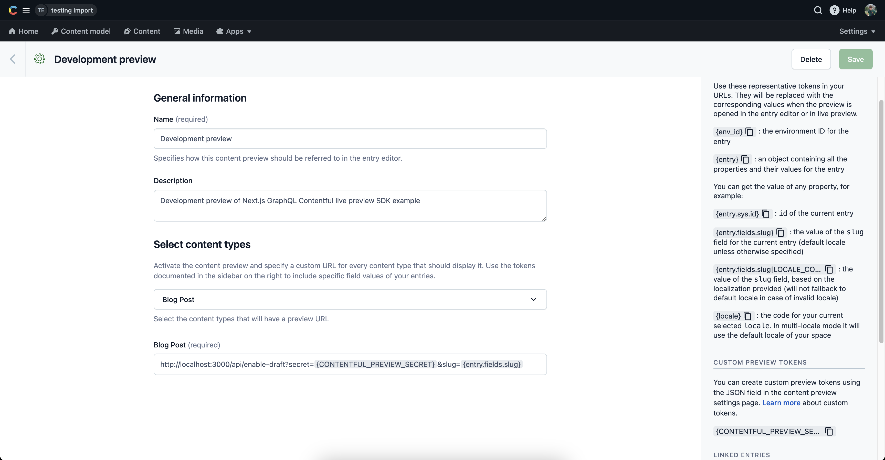

# Next.js Pages Router REST Contentful live preview SDK example

This is an example project that demonstrates how to use the `@contentful/live-preview` SDK with a Next.js Pages Router application. It is using the REST API of Contentful.

## Step 1. Installation

Install the dependencies:

```bash
npm install
```

## Step 2. Environment variables

To run this project, you will need to add the following environment variables to your `.env.local` file:

In your Contentful dashboard go to **Settings > API keys** and copy the variables.

- `CONTENTFUL_SPACE_ID`: This is the Space ID of your Contentful space.
- `CONTENTFUL_ACCESS_TOKEN`: This is the Content Delivery API access token, which is used for fetching **published** data from your Contentful space.
- `CONTENTFUL_PREVIEW_ACCESS_TOKEN`: This is the Content Preview API access token, which is used for fetching **draft** data from your Contentful space.
- `CONTENTFUL_PREVIEW_SECRET`: This can be any value you want. It must be URL friendly as it will be send as a query parameter to enable draft mode.



## Step 3. Setting up the content model

### Run a script to create the content model

This project includes a setup script which you can use to set up the content model expected by the source code.

In your Contentful dashboard go to **Settings > General Settings** and copy the **Space ID**.

Next, go to **Settings > CMA tokens** and create a new token by clicking **Create personal access token**. This token has the same access rights as the logged in user. **Do not share it publicly**, you will only use it to set up your space and can delete it afterwards.

With the space ID and management access token at hand run the following command:

```
npx cross-env CONTENTFUL_SPACE_ID=YOUR_SPACE_ID CONTENTFUL_MANAGEMENT_TOKEN=XXX npm run setup
```

This command will create the needed content structure and set up your Contentful space ready to use. The output should look as follows:

```
> cms-contentful@1.0.0 setup /Users/john.doe/documents/next-app-router
> node ./contentful/setup.js $CONTENTFUL_SPACE_ID $CONTENTFUL_MANAGEMENT_TOKEN

┌──────────────────────────────────────────────────┐
│ The following entities are going to be imported: │
├─────────────────────────────────┬────────────────┤
│ Content Types                   │ 1              │
├─────────────────────────────────┼────────────────┤
│ Editor Interfaces               │ 2              │
├─────────────────────────────────┼────────────────┤
│ Locales                         │ 1              │
├─────────────────────────────────┼────────────────┤
│ Webhooks                        │ 0              │
├─────────────────────────────────┼────────────────┤
│ Entries                         │ 0              │
├─────────────────────────────────┼────────────────┤
│ Assets                          │ 0              │
└─────────────────────────────────┴────────────────┘
 ✔ Validating content-file
 ✔ Initialize client (1s)
 ✔ Checking if destination space already has any content and retrieving it (2s)
 ✔ Apply transformations to source data (1s)
 ✔ Push content to destination space
   ✔ Connecting to space (1s)
   ...
   ...
   ...
```

### Create the content model manually

#### Create a `blogPost` type

From your Contentful space, go to **Content model** and create a content type:

- Give it the **Name** `Blog Post`, the **Api Identifier** should be `blogPost`

Next, add these fields (you don't have to modify the settings unless specified):

- `title` - **Text** field (type **short text**)
- `slug` - **Text** field. You can optionally go to the settings of this field, and under **Appearance**, select **Slug** to display it as a slug of the `title` field.
- `summary` - **Text** field (type **short text**)
- `details` - **Rich text** field
- `date` - **Date and time** field
- `author` - **Text** field (type **short text**)
- `category` - **Text** field (type **short text**)
- `heroImage` - **Media** field (type **one file**)

Save the content type and continue.

**Content model overview**



After successfully setting up the content model, make sure to populate some content in the **Content** tab.

## Step 4. Setting up Content preview

In order to enable the live preview feature in your local development environment, you need to set up the Content preview URL in your Contentful space.

In your Contentful space, go to **Settings > Content preview** and add a new content preview for development.
The **Name** field may be anything, like `Development preview`. Then, under **Select content types**, check **Blog post** and set its value to:

```
http://localhost:3000/api/enable-draft?secret={CONTENTFUL_PREVIEW_SECRET}&slug={entry.fields.slug}
```

To securely manage your `CONTENTFUL_PREVIEW_SECRET` token, consider storing it as a [Custom preview token](https://www.contentful.com/developers/docs/tutorials/general/content-preview/#custom-%20preview-tokens) within Contentful. Alternatively, you can directly embed the token into the URL by replacing `{CONTENTFUL_PREVIEW_SECRET}` with its actual value found in the .env.local file.



## Step 5. Running the project

To run the project, you can use the `npm run dev` command.

## Step 6. Deploy on Vercel

To deploy your local project to Vercel, push it to GitHub/GitLab/Bitbucket and [import to Vercel](https://vercel.com/new).

**Important**: When you import your project on Vercel, make sure to click on **Environment Variables** and set them to match your `.env.local` file.
